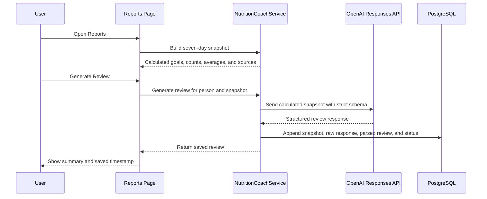

# AI Nutrition Coach

## Purpose

The AI Nutrition Coach turns a week of logged nutrition data into a concise explanation of patterns. It is designed to improve comprehension, not to replace deterministic reporting or clinical judgment.

The feature has two related AI workflows:

- Food estimation converts a food description into structured nutrient estimates, serving details, confidence, and a renal-friendly rating.
- Weekly coaching converts application-calculated nutrition facts into a structured narrative with wins, focus areas, next steps, and a care-team note.

## Grounded Review Flow

## Deterministic Facts

`NutritionCoachService.BuildSnapshot` calculates:

- Reporting dates and number of days in the period
- Number of days containing nutrition entries
- Number of food entries
- Logged binder count as context
- Personal sodium, phosphorus, potassium, and protein goals
- Average intake on logged days
- Days meeting each limit or target
- Largest food sources for each tracked nutrient

Compliance statements use `DaysLogged` as their denominator. Missing days are not silently counted as successful days.

## Structured Output

The Responses API is asked for a strict JSON object containing:

- `headline`
- `summary`
- `wins`
- `focusAreas`
- `suggestedActions`
- `careTeamNote`

The service validates that a response contains the required headline and summary before treating it as successful.

## Safety Constraints

The coach instructions prohibit the model from:

- Diagnosing a condition
- Prescribing treatment
- Recommending medication or binder changes
- Altering clinician-defined goals
- Converting binder counts into assumed absorbed phosphorus
- Claiming that a food caused a medical outcome

Phosphorus values remain logged dietary estimates. Binder count is context only because binder effectiveness depends on medication, dose, timing, meal composition, and clinical factors that this application cannot determine safely.

## Response Persistence

Every received API response is appended to `nutrition_coach_review`. Successful and unsuccessful HTTP responses are retained with:

- Person and reporting period
- Calculated request snapshot
- Full API response
- Parsed review when available
- Model identifier
- HTTP status and success state
- Error detail and timestamp

Refresh creates another record. It does not overwrite history. When Reports opens, it restores the latest successful response for the same person and reporting period.

Network failures that produce no HTTP response cannot store a provider response, because none was received.

## Data Sent to OpenAI

The weekly request includes food names, nutrient amounts, goals, compliance counts, period dates, and binder count. It does not intentionally include login credentials, API keys, database connection information, free-form account identity, or lab results.

Food names and nutrition patterns may still be sensitive health-related data. The user initiates transmission by selecting Generate Review. See [Security and Privacy](security-and-privacy.md).

## Failure Handling

- Missing keys produce a configuration message.
- Insufficient quota produces a billing/quota message.
- Non-success HTTP responses are stored before an error is returned to the UI.
- Refusals and malformed structured content are stored as unsuccessful attempts.
- A successful model response is not shown as saved unless database persistence also succeeds.

## Future Improvements

- Add a review-history screen with retention and deletion controls.
- Add automated evaluations for factual consistency and prohibited medical advice.
- Store prompt/schema version identifiers with each response.
- Add explicit consent text and configurable AI-data retention.
- Categorize foods using controlled vocabulary so source summaries can group items such as processed meats or bread products reliably.
