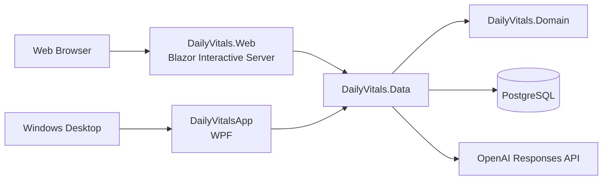
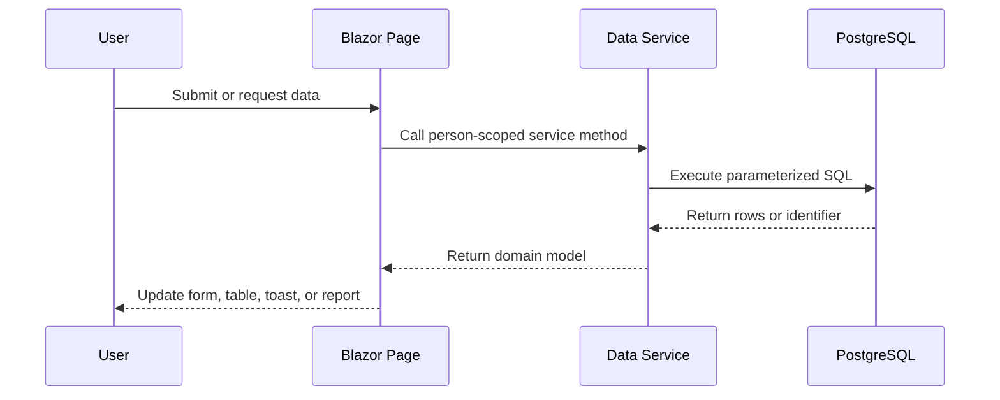

# Architecture

## Overview

DailyVitals uses a layered .NET solution with two presentation clients sharing the same domain and data-access projects.

## Project Responsibilities

### `DailyVitals.Domain`

Contains shared models used by both presentation clients and the data layer. Domain models represent readings, nutrition entries, goals, AI snapshots, and structured AI results. The project has no database or UI dependency.

### `DailyVitals.Data`

Contains application services built directly on Npgsql. Services own SQL execution, result mapping, selected schema checks, password hashing, nutrition calculations, and OpenAI requests.

The current design intentionally favors explicit SQL and small services over an object-relational mapper. This makes queries visible, but requires discipline around migrations, transactions, and repeated connection handling.

### `DailyVitals.Web`

Contains the Blazor Interactive Server UI. Pages inject data services directly, coordinate form state, and render person-scoped reports. Dependency registration and ASP.NET Core middleware are configured in `Program.cs`.

### `DailyVitalsApp`

Contains the Windows WPF client. It uses view models and shared data services to access the same PostgreSQL data.

## Web Request Flow

## AI Boundary

The AI integration is split into two responsibilities:

1. Application code calculates nutrition totals, goal compliance, data coverage, and largest nutrient sources.
2. The model converts those verified facts into concise explanatory language.

The model is not trusted to calculate compliance counts or medication effects. See [AI Nutrition Coach](ai-nutrition-coach.md) and [ADR 0001](decisions/0001-ground-ai-coaching-in-calculated-facts.md).

## Person Scope

Most health records include a `person_id`. The signed-in session carries the selected person identifier, and pages pass it to service methods. New queries should preserve this boundary in reads, updates, and deletes.

## Current Tradeoffs

- UI pages currently contain some report aggregation and presentation logic. Moving reusable calculations into focused services improves testability.
- Some services create or alter supporting tables at runtime. This keeps local development moving but is not a substitute for a controlled production migration process.
- The web login is suitable for local and portfolio use, but its browser-stored session is not a production identity system.
- Both clients share database services directly. A future public or multi-user deployment should consider an authenticated API boundary.
