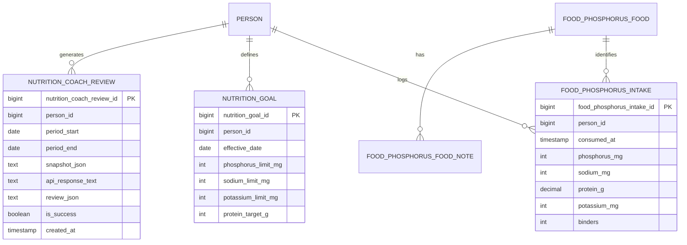

# Database Design

## Platform

DailyVitals uses PostgreSQL through Npgsql. `DailyVitals.Data.Configuration.DbConnectionFactory` reads the `DailyVitals` connection string and creates short-lived database connections for service operations.

SQL is organized in three places:

- `database/one complete DDL script.sql` provides the original baseline schema.
- `database/tables`, `database/functions`, and `database/sequences` contain focused object scripts.
- `database/migrations` contains dated incremental changes.

Several newer services also use `CREATE TABLE IF NOT EXISTS` or `ALTER TABLE ... ADD COLUMN IF NOT EXISTS` to support local upgrades. Production deployments should move these runtime checks into reviewed migrations.

## Major Data Areas

| Area | Representative tables | Purpose |
| --- | --- | --- |
| Identity and people | `person`, `login_user` | Person records and local application credentials |
| Vital readings | `blood_pressure`, `blood_glucose`, `weight`, `heart_rate` | Time-based health readings |
| Exercise | `exercise_type`, `exercise_session`, `exercise_goal` | Exercise catalog, sessions, duration, and calories |
| Nutrition | `food_phosphorus_intake`, `food_phosphorus_food`, `nutrition_goal` | Food entries, nutrient values, binders, and personal targets |
| Fluid | `fluid_intake` | Beverage and fluid-intake history |
| Kidney care | `renal_diet_food`, `kidney_lab_result` | Renal food reference data and tracked lab values |
| Rules and alerts | `vital_threshold`, `vital_alert`, `severity_escalation_rule` | Threshold evaluation and generated alerts |
| Audit support | `data_entry_log`, `nutrition_coach_review` | Data-entry history and append-only AI review records |

## Nutrition Relationships

## AI Review History

`nutrition_coach_review` is append-only from the application workflow. Every received API response creates a record containing:

- The person and reporting period
- Number of logged days
- Model identifier
- Calculated snapshot sent to the model
- Full API response text
- Parsed structured review when available
- HTTP status, success state, and error detail
- Creation timestamp

Refresh creates a new row rather than replacing an earlier response. Reports restores the latest successful review for the same person and period.

## Query and Schema Practices

- Always parameterize user-provided values.
- Include `person_id` in person-owned reads, updates, and deletes.
- Use explicit column lists and map nullable columns deliberately.
- Keep timestamps and reporting-date conversions consistent.
- Add indexes for person/date access paths used by history and reporting screens.
- Prefer additive, reversible migrations over runtime schema mutation for deployed environments.

## Migration Direction

The next database-hardening step is to make `database/migrations` the single source of schema evolution. A deployment should record applied migration identifiers, execute each migration once, and fail before application startup if the schema cannot be upgraded safely.
