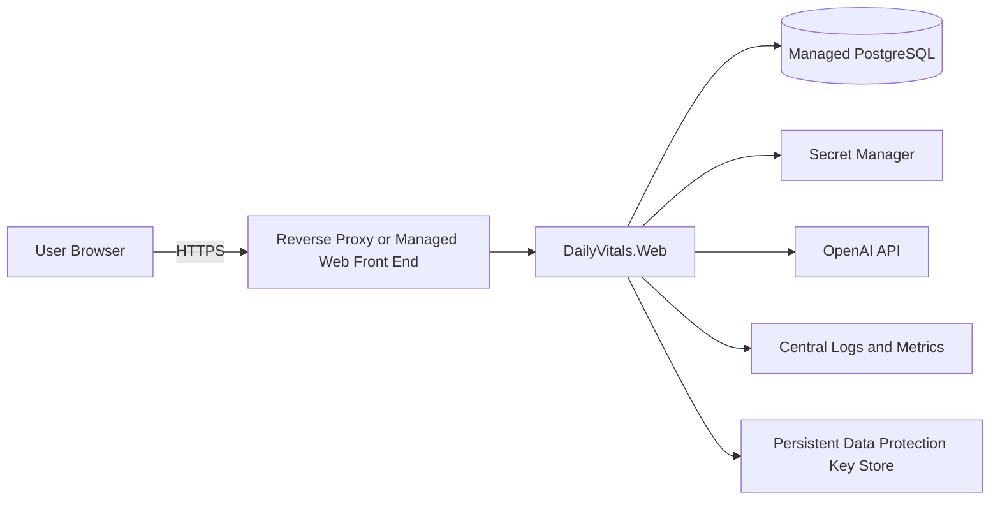

# Deployment

## Status

DailyVitals is currently structured for local development and portfolio demonstration. A production deployment requires authentication, migration, secret-management, privacy, and operational hardening described below.

## Suggested Web Topology



The WPF client is distributed separately and currently connects through the shared data layer. For an internet-facing deployment, route desktop operations through an authenticated API rather than exposing PostgreSQL directly.

## Build Artifact

Create a release build of the web project:

```powershell
dotnet publish DailyVitals.Web\DailyVitals.Web.csproj `
  --configuration Release `
  --output .\artifacts\web
```

The deployment environment must provide the connection string, OpenAI configuration, ASP.NET Core environment, HTTPS termination, and persistent Data Protection keys.

## Configuration

Use environment-specific secret management for:

- PostgreSQL connection string
- OpenAI API key
- Production identity-provider credentials
- Encryption or key-store credentials

Do not deploy development login fallback values or local `App.config` secrets.

## Database Release Process

Before application rollout:

1. Back up the target database.
2. Validate migrations against a production-like copy.
3. Apply pending migrations once through a controlled deployment step.
4. Verify indexes and expected columns.
5. Start the application only after migration success.
6. Run person-scoped smoke tests using synthetic or approved test data.

Runtime table creation should be removed or disabled once migrations become authoritative.

## Production Checklist

### Identity and authorization

- Replace local fallback authentication.
- Use secure, HTTP-only server authentication cookies or an approved identity provider.
- Enforce authorization for every person-owned operation.
- Configure lockout, session revocation, and audit events.

### Network and storage

- Enforce HTTPS and secure response headers.
- Require encrypted PostgreSQL connections.
- Restrict database network access to the application.
- Encrypt backups and test restoration.
- Store Data Protection keys in durable protected storage.

### AI operations

- Record approved model and prompt/schema versions.
- Configure API budget limits and rate limits.
- Publish user consent and data-retention behavior.
- Monitor refusal, quota, latency, and malformed-response rates.
- Provide deletion/export workflows for stored AI reviews.

### Reliability and observability

- Add readiness and liveness health checks.
- Centralize structured logs without sensitive prompt contents.
- Track request failures, database latency, and background errors.
- Define rollback procedures for application and schema changes.
- Alert on repeated sign-in failures and cross-person authorization failures.

## Smoke Test

After deployment, verify:

1. HTTPS redirects and sign-in behavior.
2. Person-scoped history loads.
3. One create/update/delete workflow with synthetic data.
4. Reports calculate the expected logged-day totals.
5. AI features handle success and missing/quota configuration safely.
6. A generated coach review persists and reloads.
7. Logs contain useful correlation data but no credentials or raw health records.
