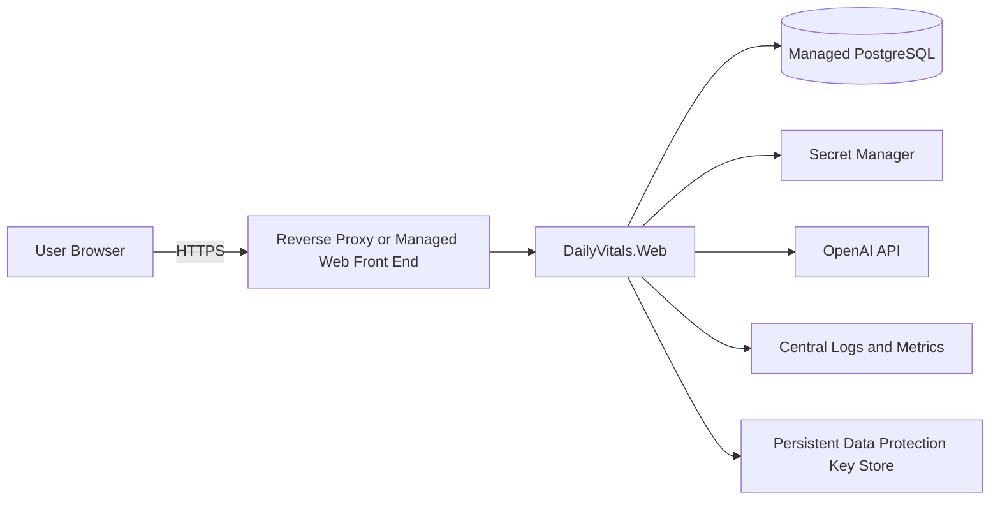

# Deployment

## Status

DailyVitals is currently structured for local development and portfolio demonstration. A production deployment requires authentication, migration, secret-management, privacy, and operational hardening described below.

## Suggested Web Topology



The WPF client is distributed separately and currently connects through the shared data layer. For an internet-facing deployment, route desktop operations through an authenticated API rather than exposing PostgreSQL directly.

## Build Artifact

Create a release build of the web project:

```powershell
dotnet publish DailyVitals.Web\DailyVitals.Web.csproj `
  --configuration Release `
  --output .\artifacts\web
```

The deployment environment must provide the connection string, OpenAI configuration, ASP.NET Core environment, HTTPS termination, and persistent Data Protection keys.

## Health Probes

- GET /health/live confirms that the web process can serve requests.
- GET /health/ready confirms that the restricted runtime database connection
  is reachable, encrypted with TLS, and does not use a PostgreSQL superuser.

Both endpoints are intentionally anonymous and return only status/check names;
they never expose connection strings, exception details, or health data. Configure
the hosting platform's liveness and readiness probes to use these paths.

## Configuration

Use environment-specific secret management for:

- PostgreSQL connection string
- OpenAI API key
- Production identity-provider credentials
- Encryption or key-store credentials

Provide the PostgreSQL connection with the standard ASP.NET Core environment
variable `ConnectionStrings__DailyVitals` or the deployment-specific alias
`DAILYVITALS_CONNECTION_STRING`. The web project does not package or require an
`App.config` file.

Use a dedicated, least-privileged PostgreSQL login for that runtime connection.
Grant only schema usage plus the table, sequence, and function permissions the
application requires. Require TLS and certificate verification in production
(`SSL Mode=VerifyFull` with the trusted PostgreSQL root certificate).
Web startup verifies the live runtime session and refuses to start when that
connection is unencrypted or its login is a PostgreSQL superuser.

Migration execution may use a separate administrative connection supplied as
`ConnectionStrings__DailyVitalsMigrations` or
`DAILYVITALS_MIGRATION_CONNECTION_STRING`. Supply that credential only to the
one-time migration job; do not expose it to the continuously running web process.
When no separate migration connection is configured, migration commands fall back
to the runtime connection for local-development compatibility.

Provide the OpenAI key through the hosting platform's secret manager using
`OpenAI__ApiKey` or `OPENAI_API_KEY`. `OpenAI__Model` or `OPENAI_MODEL` can override
the non-secret model default. Never copy a developer user-secrets file or a local
environment file into the deployment artifact.

Do not deploy development login fallback values or local `App.config` secrets. The
WPF `App.config` remains machine-local and must never be copied into a web artifact.
The repository `.dockerignore` provides a second boundary for local config files,
user-secrets files, environment files, logs, and build output. Keep those exclusions
when changing the container build context.

## Data Protection Keys

Production refuses to start until durable, encrypted ASP.NET Core Data Protection
storage is configured. Provide these settings through the hosting platform:

- `DataProtection__KeysPath`: an absolute path on a persistent volume, such as
  `/var/lib/dailyvitals/keys` or `D:\DailyVitals\Keys`.
- `DataProtection__CertificatePath`: an absolute path to a mounted PKCS#12 (`.pfx`)
  certificate containing its private key.
- `DataProtection__CertificatePassword`: the certificate password, supplied by the
  platform's secret manager (omit only when the certificate has no password).
- `DataProtection__ApplicationName`: optional isolation name; keep the default
  `DailyVitals.Web` identical across all replicas.

Mount the key directory read/write and the certificate read-only. Both must remain
available across restarts and deployments; all replicas must share the same key
directory, certificate, password, and application name. Back up the key directory
and certificate separately. Losing either one invalidates existing authentication
cookies and can make other protected payloads unreadable.

After deployment, sign in, restart or replace the application instance, and verify
that the same authentication cookie remains valid. Also confirm that new key-ring
XML files are present on the persistent volume and contain encrypted certificate
payloads rather than plaintext master keys.

## Database Release Process

Before application rollout:

1. Back up the target database.
2. Validate migrations against a production-like copy.
3. From the published application directory, apply pending migrations once:

   ```powershell
   dotnet DailyVitals.Web.dll --migrate-only
   ```

4. Verify indexes and expected columns.
5. Start the application only after migration success.
6. Run person-scoped smoke tests using synthetic or approved test data.

The runner records the migration ID, SHA-256 checksum, and application time in
`public.dailyvitals_schema_migration`. It serializes concurrent migration attempts
with a PostgreSQL advisory lock and applies each migration in its own transaction.
Never edit an applied migration; add a new ordered SQL file under
`database/migrations` instead.

Production defaults to `DatabaseMigrations:RunOnStartup=false`. Startup fails with
the pending migration IDs when the deployment step was skipped. Development enables
automatic migration application in `appsettings.Development.json`.

## Production Checklist

### Identity and authorization

- DailyVitals.Web uses encrypted, HTTP-only ASP.NET Core authentication cookies with
  server-issued person and demo claims.
- Health-data routes require an authenticated principal.
- Before using real health data, add account lockout, session revocation, and audit events.

### Network and storage

- Enforce HTTPS and secure response headers.
- Require encrypted PostgreSQL connections.
- Restrict database network access to the application.
- Encrypt backups and test restoration.
- Store Data Protection keys in durable protected storage.

### AI operations

- Record approved model and prompt/schema versions.
- Configure API budget limits and rate limits.
- Publish user consent and data-retention behavior.
- Monitor refusal, quota, latency, and malformed-response rates.
- Provide deletion/export workflows for stored AI reviews.

### Reliability and observability

- Add readiness and liveness health checks.
- Centralize structured logs without sensitive prompt contents.
- Track request failures, database latency, and background errors.
- Define rollback procedures for application and schema changes.
- Alert on repeated sign-in failures and cross-person authorization failures.

## Smoke Test

After deployment, verify:

1. HTTPS redirects and sign-in behavior.
2. Person-scoped history loads.
3. One create/update/delete workflow with synthetic data.
4. Reports calculate the expected logged-day totals.
5. AI features handle success and missing/quota configuration safely.
6. A generated coach review persists and reloads.
7. Logs contain useful correlation data but no credentials or raw health records.
