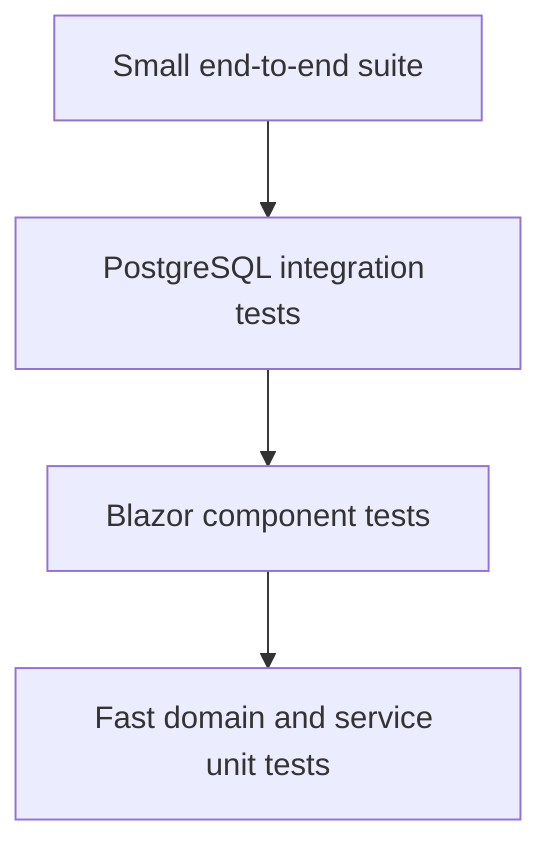

# Testing Strategy

## Current State

The repository currently relies primarily on build validation and manual workflow checks. There is no dedicated automated test project in the solution yet. This is the largest opportunity for strengthening reliability and portfolio evidence.

The minimum validation for changes is:

```powershell
dotnet build DailyVitals.slnx
```

For web-only changes when the normal output is locked:

```powershell
dotnet build DailyVitals.Web\DailyVitals.Web.csproj -o "$env:TEMP\DailyVitalsWebBuild"
```

## Recommended Test Layers



### Unit tests

Start with calculations and validation that do not need a database:

- Nutrition Coach logged-day denominator
- Sodium, phosphorus, potassium, and protein goal comparisons
- Top nutrient-source ordering and case-insensitive grouping
- Exercise calorie estimation
- Binder-related phosphorus display calculations
- AI structured-response validation
- Date-window boundaries

### Integration tests

Run service tests against an isolated PostgreSQL database or disposable container:

- Person-scoped create, read, update, and delete behavior
- Schema migrations from a clean baseline
- Nutrition goal effective-date selection
- Append-only `nutrition_coach_review` history
- Failed and successful AI response persistence
- Transaction behavior for data-entry audit logging

Integration tests must use synthetic records and disposable credentials.

### Blazor component tests

Use a Blazor component testing library to verify:

- Save and delete toasts
- Delete confirmation cancellation
- Disabled states while requests are running
- Paging controls and page boundaries
- Empty, loading, success, and error states
- AI Coach accessibility labels and restored-review rendering

### End-to-end tests

Keep browser automation focused on critical journeys:

1. Sign in and restore a remembered session.
2. Add a nutrition item and verify totals.
3. Generate a coach review using a stubbed provider response.
4. Reload Reports and verify the saved review returns.
5. Confirm one person's records cannot be accessed as another person.

## AI Evaluation

AI tests should not depend entirely on live model wording. Separate them into:

- Contract tests using recorded or stubbed valid and invalid Responses API payloads
- Grounding assertions that every numeric statement can be traced to the supplied snapshot
- Safety evaluations for medication, binder, diagnosis, and treatment advice
- A small optional live-model evaluation suite run manually or on a controlled schedule

Live tests should have budget limits and should never use real health records.

## Pull Request Evidence

Each pull request should report:

- Commands run
- Automated test results
- Manual workflows checked
- Database migration impact
- Screenshots for meaningful visual changes using synthetic data
- Remaining risks or untested paths
